# Modular Enclosure for Arduino Uno Q

Now also posted to thiniverse. See at [https://www.thingiverse.com/thing:7279865](https://www.thingiverse.com/thing:7279865)

The Arduino Uno Q has one USB C port that can be used for power and data. An external USB dongle can be used to 
breakout USB supported interfaces and power pass-through. This modular enclosure was designed to hold and protect both 
the Uno Q and a USB dongle as well as allow for convective movement of air past these devices. 

* The design was made specifically for TPU95A. It was chosen for its impact resistance and toughness. 
* The design is modular. It is desirable to be able to switch out the USB dongle section for a different dongle as the model
  used may not be available in the future.
* The different modular sections are held together with small zip ties.

## Parts Chosen

* The [USB dongle used](https://www.amazon.ca/dp/B0F9NHL23M?ref=ppx_yo2ov_dt_b_fed_asin_title).
    * Chosen for shape/dimensions that approximate the board and for the fact that it is relatively inexpensive. To date I have only tested it with a 
	  flash drive, HDMI monitor and webcam. Not currently using the Ethernet port.

	  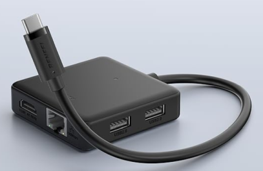
* The [zip ties used](https://www.amazon.ca/dp/B09362GP74?ref_=ppx_hzsearch_conn_dt_b_fed_asin_title_8&th=1)
* The [webcam used](https://www.amazon.ca/dp/B08CS18WVP?ref_=ppx_hzsearch_conn_dt_b_fed_asin_title_1&th=1)
    * This is the model I just happen to have. Mounted at a distance from the Q enclosure.

## Modules

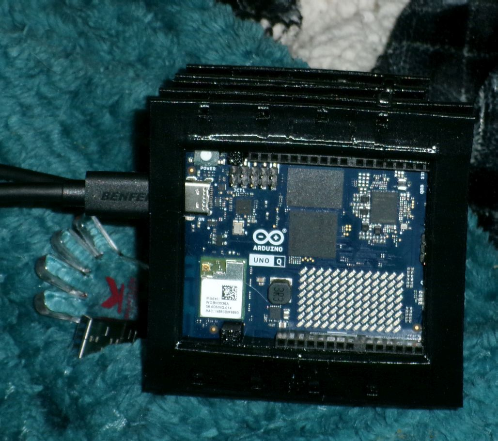

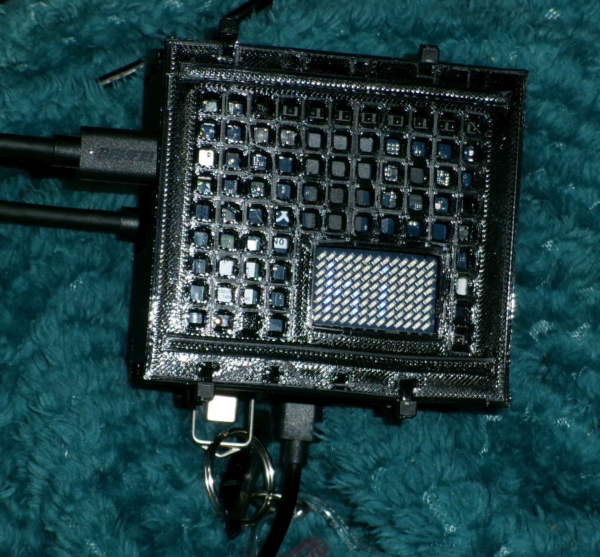

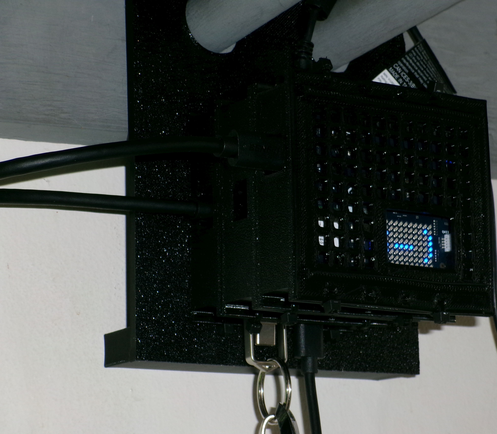

1. **vents.stl** 
	- This module was designed to hold the USB dongle. There are openings for various ports and for the USB C cable. There is one large openings
	    through which the the USB dongle is inserted. There are also vent holes which allow air movement over the large flat surfaces of the dongle.
	- This module also doubles as a spacer between the USB dongle and the Uno Q module. The point of using it as a spacer is to allow air to move and heat 
		to escape.
	- Recommend printing this module in the orientation shown below with automatic supports and support placement everywhere.

		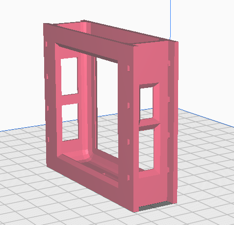
2. **UNO-Q-mount2.stl**
	- This module is essentially the vents module modified to contain the Uno Q board. There are inserts to position the board within this mount. 
		More on the inserts in section 3.
	- Recommend printing this module in the orientation shown below with automatic supports and support placement everywhere.

		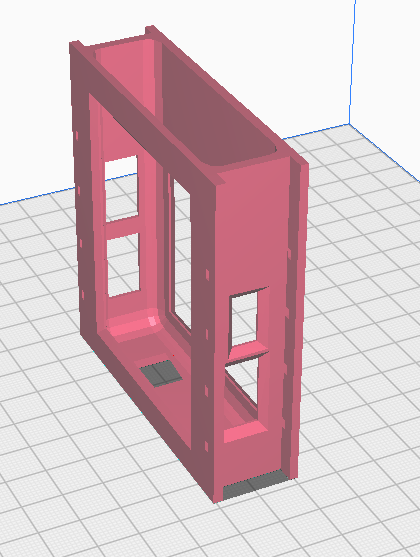

3. **insert3bottom.stl**
	- This sub module works together with insert3top.stl to position the Uno Q within vents.stl.
	- Recommend printing this sub module in the orientation shown below with automatic supports.

	  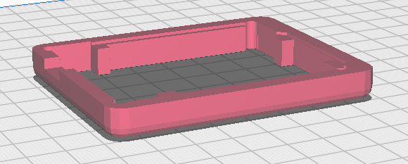

4. **insert3top.stl**
	- This sub module works together with insert3bottom.stl to position the Uno Q within vents.stl.
	- Recommend printing this sub module in the orientation shown below with automatic supports.

	  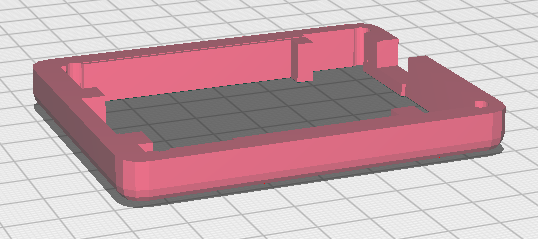

5. **ventedMount.stl** (optional)
	- This module provides space for airflow behind the USB dongle and provides mounting holes to mount the enclosure on a vertical surface.
	- Recommend printing this module in the orientation shown below with automatic supports and support placement everywhere.

	  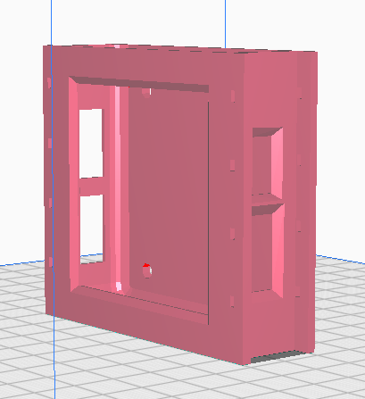

6. **UNO-Q-cover.stl**
	- This sub module provides a cover for the UNO-Q-mount2.stl module. It protects the Uno Q from mechanical damage while allowing air flow 
	  and a window for the LED matrix.

	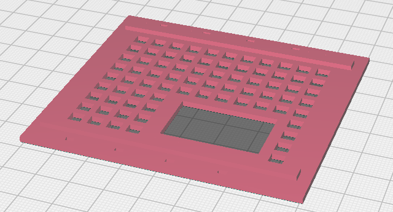
	
7. **hanger2.stl** (optional)
	- This module provides space for airflow behind the USB dongle and provides mounting holes to mount the enclosure on a vertical surface.
	- Recommend printing this module in the orientation shown below.
	
	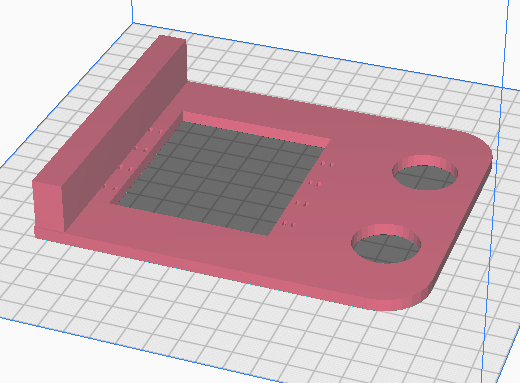

## Blender Files

The 3D models were designed primarily in Blender. Blender files of each module have been provided for easy modification. In addition the UNO-Q.blend file 
provides a reference for the Uno Q board itself. 

### UNO-Q.blend

Arduino provides a 3D model of the Uno Q in the form of STEP files. This was converted to a Blend file. Texture files that provide some of the surface features 
were created from images which have small distortions. The placement of the major components on the board are straight from the STEP file and they should be acurate. 
Blender provided a quick and easy way to create the models as many dimensions do not need to be precise. I simply eyeballed many features relative to the Uno Q model.

The image below shows the model of the Uno Q board between the top and bottom insert sub modules.

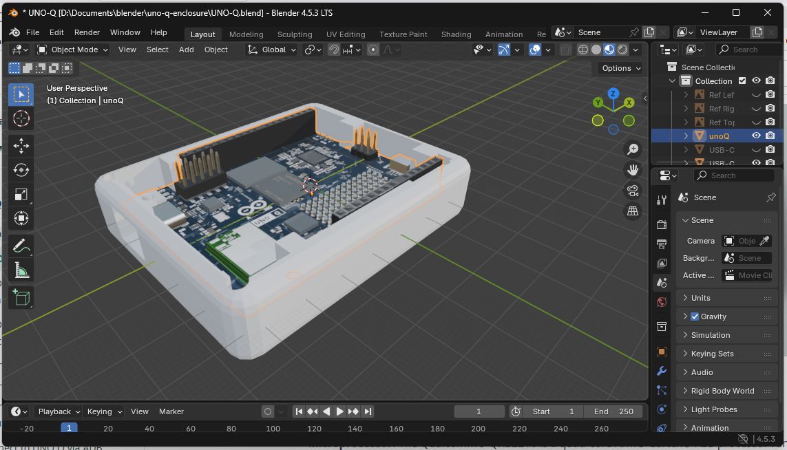

When the Blender files were created the units were not changed from 1 meter. This results in 1 meter in the blender file actually corresponding to 1 mm on the actual parts. 
Note that when exported as STL files the scale is not saved. When the STL is opened in a slicer program one unit is generally assumed to be 1 mm so the scale correction is automatically 
taken care of. Just be aware of this and if it is troubling to anyone they can easily rescale the models in Blender.

#### Known Flaws in the UNO-Q Model

* Portions of distorted texture maybe slightly shifted from the proper locations.
* The inductor to the left of the LED matrix was not correct in shape or dimensions in the STEP model and this has not been corrected.
* The 10 pin male header lacks the breakaway indents in the plastic of the actual part.
* The female headers lack the printed legend that names the contact positions.

## OpenSCAD Files

The overall dimensions of the USB dongle needed to be precise so I created a box in OpenSCAD of the overall dimensions. That box was exported as an STL and brought then imported 
into Blender. The edges of the box were rounded in Blender to approximately match the reference images of the orthographic views of the dongle. Precision was not required for this 
because the curves would be represented by segmented representations anyway and I was using flexible TPU which has some give.

I also modelled the measured dimensions of the zip ties in OpenSCAD and added a small allowance for tolerance.

The STL files exported from OpenSCAD have not been included in this repository as I thought they may just cause confusion. Those were only used in Blender and never printed.

## STL Viewer

Some may not be aware that Github has a built in STL viewer. You can view STL files from the Github site before downloading anything simly by clicking 
on the file name in the list at the very top of the page. The model can be rotated and zoomed.
